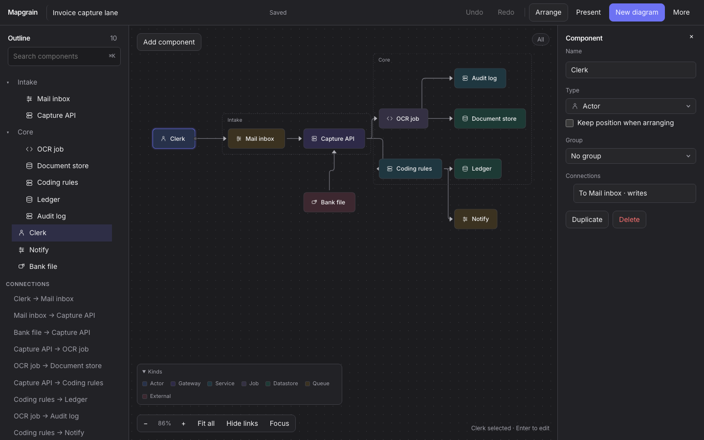
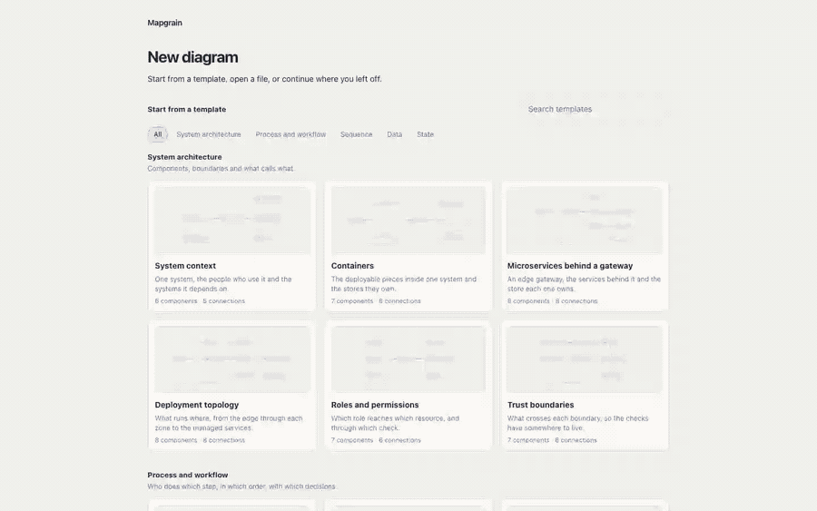
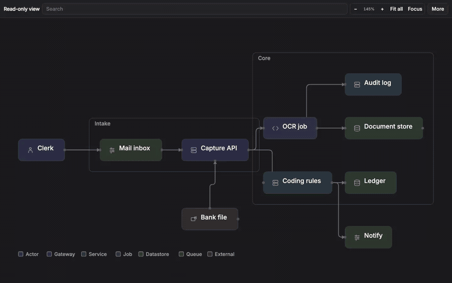
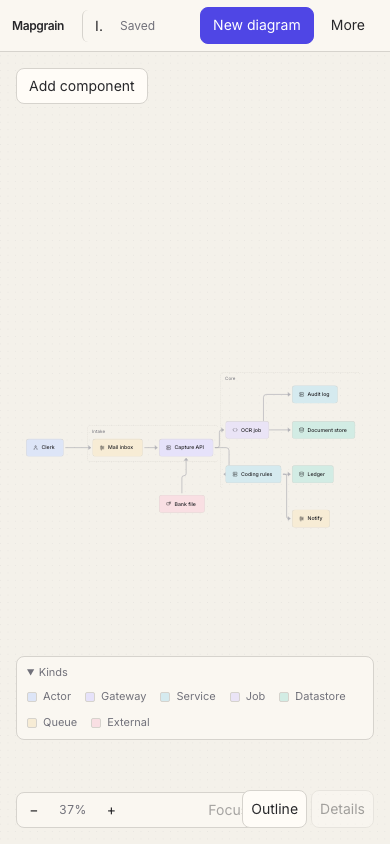
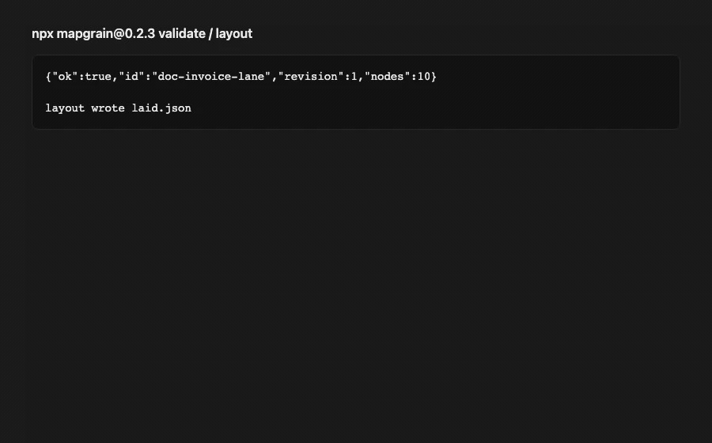

# Mapgrain

A local workspace for architecture, workflow, sequence, data-flow, and lifecycle diagrams you can edit by hand, generate through an agent, and send as offline HTML.



Light theme: [hero-light.png](docs/media/hero-light.png). Capture notes: [docs/media/capture.json](docs/media/capture.json).

## Try it

Edit a label, connect two nodes, pin one, preview Arrange, then undo:



Open exported HTML without a server. Search, change theme, pan:



At 390px the canvas stays the main surface:



## CLI and skill

```sh
npx mapgrain@0.2.0 validate diagram.json
npx mapgrain@0.2.0 layout diagram.json
npx mapgrain@0.2.0 view diagram.json -o view.html
npx skills add ensp1re/mapgrain --skill mapgrain --yes --agent cursor
```



Those frames are CLI receipts, not a live agent prompt. Install paths are tested; live prompt runs are not. Matrix: [docs/agents.md](docs/agents.md). Walkthrough: [docs/getting-started.md](docs/getting-started.md).

## What is shipped

See [docs/FEATURES.md](docs/FEATURES.md) for shipped, partial, planned, and deferred rows. Short version:

- Architecture, workflow, sequence, data-flow, and lifecycle documents with mode-specific validation
- Editor: direct edit, arrange preview, save, export, offline production bundle
- Portable HTML: search, fit, reach, route, named views, stories, role lenses, en/uk chrome
- CLI: validate, layout, view, export, diagnose, compare, watch, doctor, studio
- Presets, share-card PNG, and story video from the first authored story

Not shipped: hosted sharing, Mermaid/draw.io import, and live agent prompt runs. Historical `npx mapgrain@0.1.0` still rejects sequence, data-flow, and lifecycle fixtures.

## Examples

| File | Kind |
| --- | --- |
| [tests/fixtures/documents/nested-groups.json](tests/fixtures/documents/nested-groups.json) | Architecture with nested groups |
| [tests/fixtures/documents/workflow-decision.json](tests/fixtures/documents/workflow-decision.json) | Workflow decision with labelled outcomes |
| [skills/mapgrain/examples/ten-node.json](skills/mapgrain/examples/ten-node.json) | 10-node invoice lane used in the hero still |

Each file validates, lays out, and exports JSON/SVG/PNG/HTML.

## Requirements

- Node.js 24 LTS (CI). Node 26 is accepted locally.
- pnpm 10 for this repository. End users only need `npx`.

```sh
pnpm install
pnpm verify
```

Development CLI: `pnpm mapgrain` (source `0.2.1`). Last published package: `mapgrain@0.2.0`. Historical architecture/workflow package: `mapgrain@0.1.0`. Internals are bundled. Do not use `npx mapgrain@latest`. Do not overwrite `0.1.0` or `0.2.0`.

## License

MIT. See [LICENSE](LICENSE).
